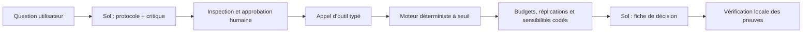

# NormLab

NormLab transforme une question d’adoption de l’IA en expérience inspectable.
GPT‑5.6 Sol conçoit et critique le protocole ; un moteur déterministe d’agents à
seuil exécute les scénarios ; NormLab compare les interventions et produit une fiche
qui sépare résultat, hypothèse, limite et prochaine donnée à recueillir.

> **Ce produit ne fait pas de prévision.** Les organisations, comportements et
> résultats sont synthétiques, non calibrés et conditionnels aux hypothèses visibles.

## Parcours produit



Le modèle ne pilote jamais les agents simulés et ne produit aucun résultat numérique
à la place du moteur. Une valeur du protocole porte toujours l’une des provenances
`provided`, `inferred` ou `system_default`. Les quatre stratégies classées utilisent
le même nombre de pilotes et les mêmes organisations/graines par réplication.
`broadcast`, dont l’unité de ressource diffère, reste hors classement.

## Démonstration locale

Prérequis : Python 3.11 ou plus récent.

```bash
python3 -m venv .venv
source .venv/bin/activate
python -m pip install -r requirements-dev.txt
python -m pytest
streamlit run demo/app.py
```

Sans clé, le parcours fonctionne avec une fixture déterministe clairement étiquetée :
elle ne prétend jamais être Sol. Pour tester l’intégration réelle, fournir la clé par
l’environnement, jamais dans un fichier suivi :

```bash
export OPENAI_API_KEY="..."
streamlit run demo/app.py
```

La clé ne doit être ni copiée dans `.env.example`, ni committée, ni affichée dans une
trace. La cible est l’identifiant explicite `gpt-5.6-sol` avec la Responses API,
sorties structurées, outil strict, `store=False` et effort de raisonnement `medium`.
Voir [docs/OPENAI_INTEGRATION.md](docs/OPENAI_INTEGRATION.md).

## Ce qui est nouveau

Le moteur historique existait avant le 13 juillet 2026. Six fichiers nécessaires ont
été portés sans modification depuis `adoption-sim` au commit
`0e2d2601332b64981a80c816a4820e5a5a25c669`, sous AGPL‑3.0. Leur provenance et leurs
empreintes sont vérifiées à chaque test dans
[docs/provenance/LEGACY_ENGINE.json](docs/provenance/LEGACY_ENGINE.json).

Les apports `build-week-new` sont :

- les schémas stricts du protocole, de la critique, des résultats et de la fiche ;
- la provenance champ par champ et le garde-fou lexical sur les faits numériques ;
- l’orchestrateur de réplications appariées et le registre de budgets ;
- l’analyse de sensibilité sur seuil moyen, concentration, silos et visibilité ;
- le drapeau obligatoire d’équivalence `theta / visibility` ;
- l’intégration GPT‑5.6 Sol en deux étapes et la vérification des preuves ;
- l’interface centrée sur une question en langage naturel et les exports d’audit ;
- les tests, evals hors ligne, CI et documentation de Build Week.

L’inventaire pré-Build Week est dans [docs/BASELINE.md](docs/BASELINE.md) ; la frontière
d’architecture est dans [docs/ARCHITECTURE.md](docs/ARCHITECTURE.md).

## Validation

```bash
python -m pytest
python -m compileall -q normlab demo
```

La suite couvre la parité par empreinte du moteur, ses invariants historiques, la
reproductibilité complète, les budgets, les scénarios de sensibilité, la provenance,
le contrat d’outil Sol, le rejet de preuves inventées et le parcours Streamlit hors
ligne. Les appels unitaires ne dépendent ni du réseau ni d’une clé API.

## Déploiement

Le dépôt est préparé pour Streamlit Community Cloud avec `demo/app.py` comme point
d’entrée. La procédure et le smoke test jury sont dans
[docs/DEPLOYMENT.md](docs/DEPLOYMENT.md). L’URL publique ne sera inscrite ici qu’après
déploiement et vérification ; une configuration locale ne constitue pas une preuve de
déploiement.

## Rôle de Codex et de GPT‑5.6 Sol

Codex a inspecté la référence en lecture seule et construit pendant cette tâche la
majorité du produit NormLab : gouvernance, portage traçable, schémas, garde-fous,
orchestrateur, intégration OpenAI, interface, tests/evals et documentation. La tâche
Codex doit rester identifiable via son identifiant `/feedback` pour le concours.

GPT‑5.6 Sol intervient à l’exécution du produit : il traduit la question en protocole
structuré, critique l’expérience, demande l’appel de l’outil déterministe après
approbation humaine et rédige la fiche à partir du résultat retourné. Sol ne modifie
ni le moteur ni le protocole approuvé, ne convertit pas des budgets sans hypothèse
explicite et ne remplace pas le calcul. Les responsabilités complètes sont consignées
dans [docs/CODEX_COLLABORATION.md](docs/CODEX_COLLABORATION.md).

## Licence

AGPL‑3.0-only. Voir [LICENSE](LICENSE) et [NOTICE.md](NOTICE.md).
