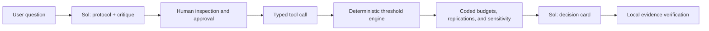

# NormLab

NormLab turns an organizational AI-adoption question into an inspectable experiment.
GPT‑5.6 Sol designs and critiques the protocol; a deterministic threshold-agent
engine runs the scenarios; NormLab compares interventions and produces a decision
card that separates results, assumptions, limitations, and the next data to collect.

> **This product does not make forecasts.** Organizations, behaviors, and results
> are synthetic, uncalibrated, and conditional on visible assumptions.

## Product journey



The model never controls simulated agents and never substitutes prose for numerical
engine output. Every protocol value has one provenance label: `provided`, `inferred`,
or `system_default`. The four ranked strategies use the same pilot count and the same
organizations/seeds in each paired replication. `broadcast` uses a different resource
unit and therefore remains outside the main ranking.

## Local demo

Requirement: Python 3.11 or newer.

On macOS, double-click `Lancer NormLab.command`, or run:

```bash
python3 -m venv .venv
source .venv/bin/activate
python -m pip install -r requirements-dev.txt
python -m pytest
streamlit run demo/app.py
```

Without a key, the journey uses a clearly labeled deterministic fixture that never
pretends to be Sol. To test the live integration, provide the key through the
environment, never through a tracked file:

```bash
export OPENAI_API_KEY="..."
streamlit run demo/app.py
```

In the public demo, an evaluator may instead open “Test GPT‑5.6 Sol with a temporary
API key” and supply a project key for the current session. NormLab does not write the
key to a file, include it in exports, or retain it after the session is cleared. Calls
are billed to the account associated with the supplied key. Offline fixture mode
remains available without a key.

Never copy a key into `.env.example`, commit it, or expose it in a trace. The explicit
model target is `gpt-5.6-sol`, using the Responses API, structured outputs, a strict
tool, `store=False`, and `medium` reasoning effort. See
[docs/OPENAI_INTEGRATION.md](docs/OPENAI_INTEGRATION.md).

## What is new for Build Week

The historical engine existed before July 13, 2026. Six required files were ported
without modification from `adoption-sim` at commit
`0e2d2601332b64981a80c816a4820e5a5a25c669` under AGPL‑3.0. Their provenance and
hashes are checked in every test through
[docs/provenance/LEGACY_ENGINE.json](docs/provenance/LEGACY_ENGINE.json).

The `build-week-new` contributions are:

- strict schemas for the protocol, critique, results, and decision card;
- field-level provenance and a lexical guardrail for user-provided numeric facts;
- paired-replication orchestration and a budget ledger;
- sensitivity analysis over mean threshold, concentration, silos, and visibility;
- a mandatory `theta / visibility` non-identifiability flag;
- the two-stage GPT‑5.6 Sol integration and evidence verification;
- a natural-language interface and audit exports;
- tests, offline evals, CI, and Build Week documentation.

The pre-Build Week inventory is in [docs/BASELINE.md](docs/BASELINE.md), and the
architecture boundary is in [docs/ARCHITECTURE.md](docs/ARCHITECTURE.md).

## Validation

```bash
python -m pytest
python -m compileall -q normlab demo
```

The suite covers engine hash parity, historical invariants, full reproducibility,
budgets, sensitivity scenarios, provenance, the Sol tool contract, rejection of
invented evidence, and the offline Streamlit journey. Unit tests require neither
network access nor an API key.

## Deployment

**Public demo:**
[normlab-build-week-2026.streamlit.app](https://normlab-build-week-2026.streamlit.app/)

Streamlit Community Cloud deploys `demo/app.py` from `codex/build-week-mvp`. The
offline journey and a live GPT‑5.6 Sol journey were verified end to end on the public
deployment by July 19, 2026. Without a temporary evaluator key, the interface
explicitly shows “Offline fixture — Sol not called.” No owner-funded API secret is
required on the platform.

Deployment and evaluator smoke-test instructions are in
[docs/DEPLOYMENT.md](docs/DEPLOYMENT.md).

## Roles of Codex and GPT‑5.6 Sol

Codex inspected the historical reference in read-only mode and built most of NormLab
during this task: governance, traceable porting, schemas, guardrails, orchestration,
OpenAI integration, interface, tests/evals, and documentation. The Codex task remains
identifiable through its `/feedback` identifier for the competition submission.

At product runtime, GPT‑5.6 Sol turns the question into a structured protocol,
critiques the experiment, requests the deterministic tool call after human approval,
and writes a decision card grounded in the returned engine output. Sol does not alter
the engine or approved protocol, silently convert budgets, or replace computation.
The full responsibility boundary is documented in
[docs/CODEX_COLLABORATION.md](docs/CODEX_COLLABORATION.md).

## Build Week evidence

The dated build trace and validations are recorded in [BUILD_WEEK.md](BUILD_WEEK.md).
The final video runbook is in [docs/DEMO_SCRIPT.md](docs/DEMO_SCRIPT.md), and the
submission image set is documented in
[docs/submission-assets/README.md](docs/submission-assets/README.md).

## License

AGPL‑3.0-only. See [LICENSE](LICENSE) and [NOTICE.md](NOTICE.md).
